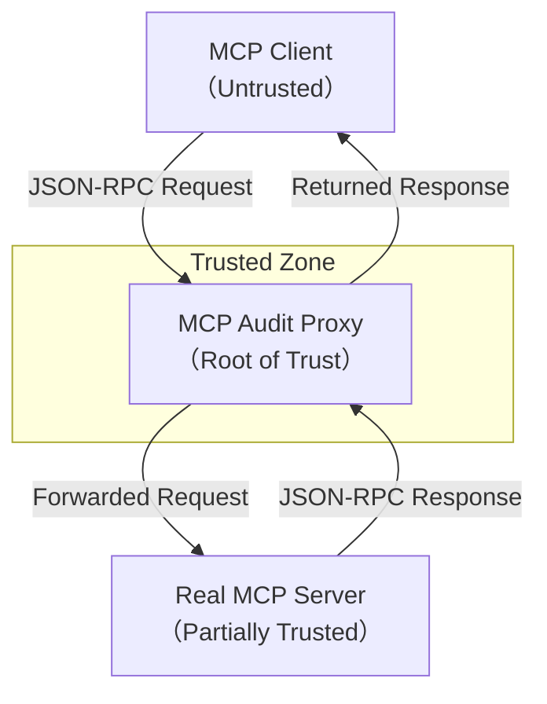
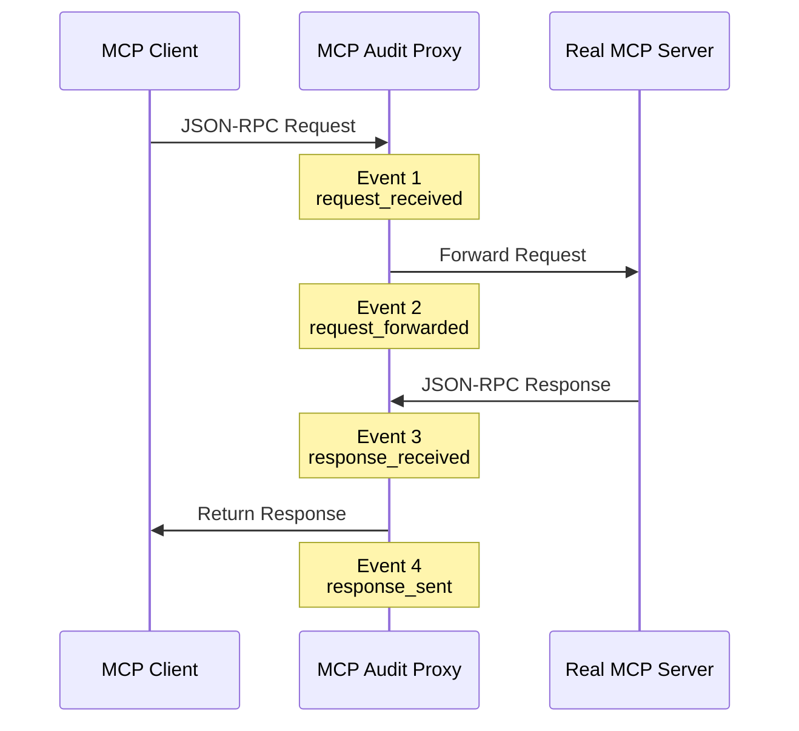

# Architecture of MCP Audit Proxy
(MCP監査プロキシのアーキテクチャ)

## 1. Purpose of This Document（このドキュメントの目的）

### 日本語

本ドキュメントは、**MCP Audit Proxy の全体アーキテクチャ**を説明し、
「なぜこの Proxy が *監査・法務・セキュリティの観点で信頼できるのか*」を
**構造レベルで理解できるようにする**ことを目的とします。

特に以下を明確にします。

* MCP Client / Proxy / MCP Server 間で **何が起きているか**
* **どこが信頼境界で、何を証拠として残すのか**
* ハッシュチェーンが **どこで・なぜ組み込まれているか**

実装詳細ではなく、**設計上の意図と責任分界点**を説明する文書です。

### English

This document explains the **overall architecture of MCP Audit Proxy**
and aims to make it clear **why this proxy can be trusted from audit, legal, and security perspectives**.

Specifically, it clarifies:

* What happens between MCP Client, Proxy, and MCP Server
* Where **trust boundaries** exist and what is recorded as evidence
* Where and why the **hash chain** is integrated

This document focuses on **architectural intent and responsibility boundaries**,
not low-level implementation details.

## 2. 全体構成（High-Level Architecture Overview）

### 日本語

MCP Audit Proxy は、**MCP Client と実際の MCP Server の間に配置される中継コンポーネント**です。

Client から見ると通常の MCP Server と同じ振る舞いをしますが、
内部では以下を同時に実現します。

* リクエスト／レスポンスの **透過的中継**
* 監査イベントの生成
* 改ざん検知可能な **ハッシュチェーンログの構築**

### English

MCP Audit Proxy is an **intermediary component placed between the MCP Client and the real MCP Server**.

From the client’s perspective, it behaves like a normal MCP Server.
Internally, it simultaneously provides:

* Transparent request/response forwarding
* Generation of audit events
* Construction of a **tamper-evident hash-chained log**

## 3. 信頼境界の定義（Trust Boundaries）

### 日本語

本アーキテクチャでは、以下を **信頼境界（Trust Boundary）** として定義します。

* **MCP Client**：信頼しない

  * リクエスト内容は捏造・誤用の可能性がある
* **MCP Audit Proxy**：信頼の起点

  * 証拠生成と記録の責任主体
* **Real MCP Server**：部分的に信頼

  * 応答内容は記録するが、正当性は Proxy が担保しない

> **「Proxy に到達した事実」以降のみが監査可能領域**です。

### English

This architecture defines the following **trust boundaries**:

* **MCP Client**: Untrusted

  * Requests may be forged or misused
* **MCP Audit Proxy**: Root of trust

  * Responsible for evidence generation and recording
* **Real MCP Server**: Partially trusted

  * Responses are recorded, but their correctness is not guaranteed by the proxy

> Only events **observed by the proxy** are considered auditable.

## 4. 中核コンポーネント（Core Components）

### 日本語

MCP Audit Proxy は、論理的に以下のコンポーネントから構成されます。

* **Protocol Adapter**

  * stdio / HTTP などの差異を吸収
* **Request Handler**

  * Client リクエストの受信と検証
* **Forwarder**

  * Real MCP Server への転送
* **Audit Event Generator**

  * 監査イベントの生成
* **Hash Chain Engine**

  * イベントを順序付きで連結
* **Log Store**

  * 監査ログ／調査ログの永続化

### English

MCP Audit Proxy is logically composed of the following components:

* **Protocol Adapter**

  * Abstracts stdio / HTTP differences
* **Request Handler**

  * Receives and validates client requests
* **Forwarder**

  * Sends requests to the real MCP Server
* **Audit Event Generator**

  * Creates audit-relevant events
* **Hash Chain Engine**

  * Links events in a strict order
* **Log Store**

  * Persists audit and investigation logs

## 5. リクエスト／レスポンスの流れ（Data Flow）

### 日本語

Client からは **1 回のツール呼び出し**に見えますが、
Proxy 内部では複数の意味的イベントに分解されます。

代表的な流れは以下です。

1. request_received
2. request_forwarded
3. response_received
4. response_sent

これらが **監査可能な証拠点**となります。

### English

Although the client perceives a **single tool invocation**,
the proxy internally decomposes it into multiple semantic events:

1. request_received
2. request_forwarded
3. response_received
4. response_sent

These events serve as **auditable evidence points**.

## 6. stdio / HTTP の扱い（Transport Abstraction）

### 日本語

MCP Audit Proxy は、**通信方式に依存しない設計**を採用します。

* stdio / HTTP / 将来の Transport はすべて同一の内部イベントに正規化
* 監査ログは **Transport 非依存**

これにより、**通信手段が変わっても証拠の意味は不変**です。

### English

MCP Audit Proxy uses a **transport-agnostic design**.

* stdio, HTTP, and future transports are normalized into the same internal events
* Audit logs are **independent of transport**

This ensures that **the meaning of evidence remains stable**, regardless of transport changes.

## 7. 監査ログと調査ログの分離（Logging Architecture）

### 日本語

ログは目的別に分離されます。

* **Audit Log**

  * 最小限・改ざん検知対象
  * 法務・外部監査向け
* **Investigation Log**

  * 詳細情報（payload 等）
  * 運用・障害対応向け

個人情報を含む場合、**調査ログのみ制限付きで保持**します。

### English

Logs are separated by purpose:

* **Audit Log**

  * Minimal and tamper-evident
  * For legal and external audits
* **Investigation Log**

  * Detailed data (e.g., payloads)
  * For operations and incident response

When personal data is involved, **only investigation logs retain it under strict access control**.

## 8. ハッシュチェーンの組み込み位置（Hash Chain Integration）

### 日本語

ハッシュチェーンは **監査イベント単位**で構築されます。

* 各イベントは直前イベントのハッシュを含む
* イベント順序は `event_seq` により保証

これにより、**イベントの削除・差し替え・並び替えが検知可能**になります。

### English

The hash chain is built **per audit event**.

* Each event includes the hash of the previous event
* Ordering is enforced via `event_seq`

This makes **deletion, insertion, or reordering of events detectable**.

## 9. 再起動・障害時の挙動（Restart & Failure Handling）

### 日本語

Proxy 再起動時は、**新しいチェーンセグメント**を開始します。

* 起動時に `chain_start` イベントを生成
* 前回の最終ハッシュを継承

これにより、**再起動を挟んでも論理的には1本のチェーン**として検証可能です。

### English

On proxy restart, a **new chain segment** is started.

* A `chain_start` event is emitted on boot
* The previous chain’s final hash is inherited

This allows the chain to be **logically continuous across restarts**.

## 10. PoCと本番の差分（PoC vs Production Architecture）

### 日本語

PoC では以下を簡略化します。

* 単一ノード構成
* ローカルストレージ
* 外部署名・時刻アンカーなし

本番では以下を追加します。

* 外部署名／時刻証明
* 書き込み専用ストレージ
* RBAC・監査人アクセス分離

### English

In the PoC, the following are simplified:

* Single-node deployment
* Local storage
* No external signing or time anchoring

Production adds:

* External signatures / time proofs
* Append-only storage
* RBAC and auditor access separation

## 11. やらないこと（Non-Goals）

### 日本語

本プロジェクトは以下を目的としません。

* MCP Server の正当性保証
* リクエスト内容の意味理解
* 不正利用の自動検知・ブロック

あくまで **「嘘をつけない記録を残す」**ことに集中します。

### English

This project does NOT aim to:

* Guarantee correctness of MCP Server behavior
* Interpret semantic meaning of requests
* Automatically detect or block misuse

Its sole focus is **creating records that cannot lie**.
