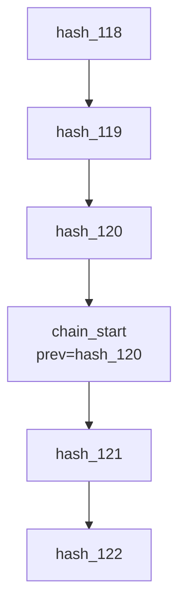

# Hash Chain Design for MCP Audit Proxy
（MCP Audit Proxy におけるハッシュチェーン設計）


## 1. このドキュメントの目的(Purpose of This Document)

### 日本語

本ドキュメントは、MCP Audit Proxy が生成する監査ログが  
**なぜ改ざん不能であり、なぜ否認できないのか** を  
技術的に説明することを目的とします。

これは実装仕様書ではなく、  
**監査人・法務・セキュリティ担当が理解するための説明書**です。


### English

This document explains **why audit logs generated by MCP Audit Proxy
are tamper-evident and non-repudiable**, from a technical perspective.

It is not an implementation manual,  
but a justification document for auditors, legal teams, and security reviewers.


## 2. なぜ通常のログでは不十分なのか(Why Traditional Logs Are Insufficient)

### 日本語

一般的なログには次の弱点があります。

* 過去ログを書き換えても検知できない
* 一部を削除しても気づかれない
* ログ生成者自身が改ざんできる

そのため法務・監査の場では、  
**「ログが存在する」だけでは証拠になりません。**


### English

Traditional logs suffer from critical weaknesses:

* Past entries can be modified without detection
* Entries can be deleted silently
* Log operators themselves can tamper with logs

Therefore, logs alone are often insufficient as legal evidence.


## 3. ハッシュチェーンとは何か(What Is a Hash Chain?)

### 日本語

ハッシュチェーンとは、  
**各イベントが直前のイベントのハッシュ値を含む**構造です。

```
Event N:
hash = H(event_payload + previous_hash)
```

これにより：

* 過去のイベントを変更すると、以降すべてが破綻する
* イベントの順序が保証される
* 一部だけの削除が不可能になる


### English

A hash chain links events by embedding
the hash of the previous event into the current one.

```
Event N:
hash = H(event_payload + previous_hash)
```

This ensures:

* Tampering with any past event breaks the chain
* Event ordering is enforced
* Partial deletion is detectable


## 4. MCP Audit Proxy におけるチェーン単位(Chain Scope in MCP Audit Proxy)

### 日本語

MCP Audit Proxy では、  
**1つの監査イベント = 1つのチェーン要素**です。

* チェーンは **グローバルに連続**
* `trace_id` は論理的な束ね
* ハッシュチェーンは物理的な時系列保証

**trace_id ≠ チェーン**


### English

In MCP Audit Proxy:

* Each audit event is a chain element
* The hash chain is global and continuous
* `trace_id` groups related events logically

`trace_id` is not the chain itself.


## 5. ハッシュ対象に含める項目(What Is Included in the Hash)

### 日本語

各監査イベントのハッシュは、以下の **最小構成要素** から計算されます。

* trace_id  
* event_seq  
* event_type  
* event_time  
* prev_hash  

この設計により、以下が保証されます。

* イベントの順序性（event_seq）
* イベント種別の否認防止（event_type）
* 時系列の整合性（event_time）
* 過去改ざんの検知（prev_hash）

payload の実体や識別子（event_id / request_id）は  
**ハッシュチェーンの対象外**とし、  
個人情報や実装依存性を排除しています。


### English

Each audit event hash is calculated from the following minimal elements:

* trace_id  
* event_seq  
* event_type  
* event_time  
* prev_hash  

This design guarantees:

* Event ordering (event_seq)
* Non-repudiation of event semantics (event_type)
* Temporal consistency (event_time)
* Tamper detection of historical records (prev_hash)

Payload contents and implementation-specific identifiers
(e.g., event_id, request_id) are intentionally excluded
to avoid personal data exposure and implementation coupling.


## 6. 再起動時のチェーン設計(Restart and Chain Continuity)

### 日本語

Proxy 再起動時には：

* 新しいチェーンを開始
* `chain_id` を更新
* 直前チェーンの最終ハッシュを **chain_anchor** として保存

これにより：

* 再起動は明確に検知可能
* 過去チェーンとの連続性は証明可能


### English

On proxy restart:

* A new chain is started
* A new `chain_id` is issued
* The last hash of the previous chain is stored as a `chain_anchor`

This makes restarts explicit and verifiable.


### 6.1. 再起動時のチェーン継続性(Restart and Chain Continuity)



#### 日本語

Proxy の再起動は、監査上の重要イベントです。
監査人は必ず次の疑問を持ちます。

> 「サーバが停止していた間に、ログが削除・改ざんされたのではないか？」

MCP Audit Proxy は、この疑念を **技術的に否定できる設計**を採用します。

#### チェーン分割モデル（Chain Segment Model）

* Proxy **起動ごとに新しいチェーンセグメントを開始**
* ただし、**直前チェーンの最終ハッシュを必ず継承**

これにより：

* 再起動は必ず検知可能
* 過去ログとの連続性は暗号学的に証明可能
* 再起動中の隠蔽は不可能


#### 起動時イベント（必須）

```json
{
  "event_type": "chain_start",
  "boot_id": "boot-2026-01-22T09:00",
  "prev_chain_tail_hash": "hash_of_previous_run"
}
```

初回起動のみ：

```json
"prev_chain_tail_hash": "GENESIS"
```

#### 再起動後のチェーン構造

```
[Previous Chain]
  ...
  hash_120

--- Proxy Restart ---

[New Chain Segment]
  chain_start (prev = hash_120)
  hash_121
  hash_122
```

* 物理的には分割されるが、
* **論理的には一本の監査チェーン**


#### English

Proxy restarts are treated as audit-significant events.

Auditors will inevitably ask:

> “Could logs have been altered or deleted during downtime?”

MCP Audit Proxy addresses this concern through a **chain segment model**.


#### Chain Segment Model

* Each proxy boot starts a new chain segment
* The final hash of the previous segment is inherited

This ensures:

* Restarts are explicitly visible
* Historical continuity is cryptographically provable
* Concealment during downtime is infeasible


## 7. 外部アンカー（定期署名）(External Anchoring)

### 日本語

高度な運用では、以下が可能です。

* 定期的に最終ハッシュを外部に送信
* 例：
  * WORM ストレージ
  * 公開タイムスタンプ
  * 監査用署名サーバ

**Proxy 単独での隠蔽を防止**


### English

For higher assurance, the final hash can be periodically anchored externally:

* WORM storage
* Public timestamping
* External signing services

This prevents concealment even by proxy operators.


## 8. 削除要求（GDPR 等）との両立(Coexistence with Deletion Requests)

### 日本語

個人情報削除時：

* payload の実体は削除
* payload_hash は残存
* ハッシュチェーンは維持

**「内容は消えたが、出来事は消えない」**


### English

When personal data must be deleted:

* Raw payloads are removed
* Payload hashes remain
* Hash chain integrity is preserved

**Content is erased, but the fact remains.**


## 9. 一文での定義(One-Sentence Definition)

### 日本語

> ハッシュチェーンとは「後から嘘をつくことを、
> 技術的に非常に難しくする仕組み」である。

### English

> A hash chain is a mechanism that makes lying about the past
> technically infeasible.


